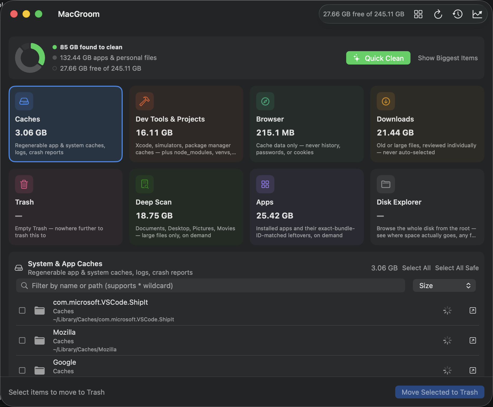
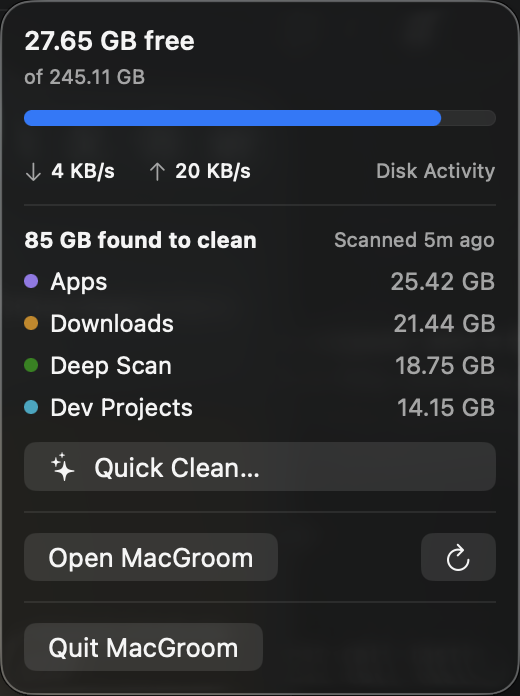
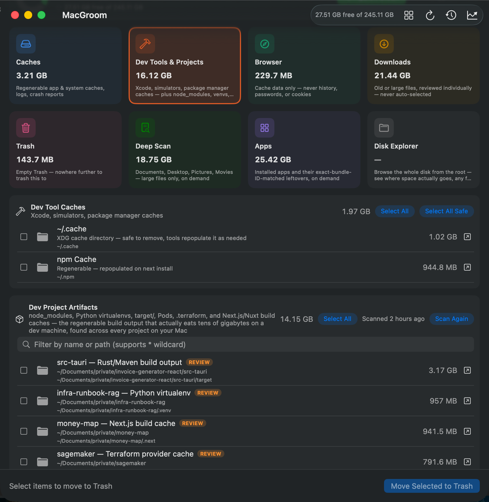
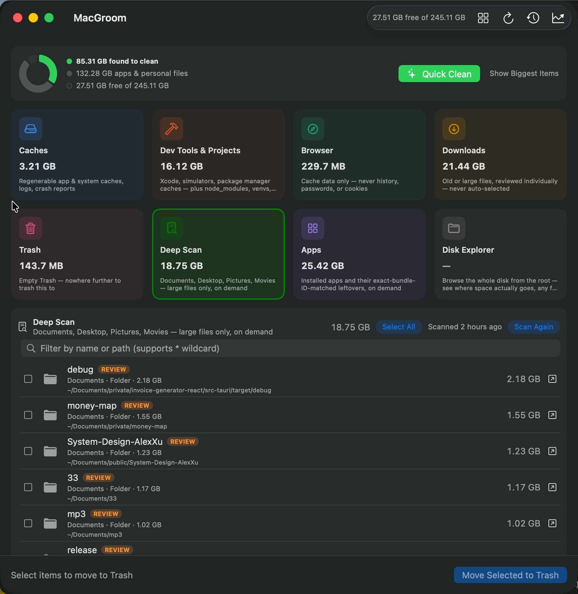

# MacGroom Support

Public issue tracker, changelog, and technical documentation for **[MacGroom](https://gogenops.com/mac-apps/macgroom/)** — a native macOS disk-cleanup utility — and the rest of the MacGroom suite of Mac apps.

This repo doesn't contain MacGroom's app source (see [Is MacGroom's source code open?](#is-macgrooms-source-code-open)) — it exists so bugs, feature requests, and technical questions have a real, versioned place to live instead of getting lost in email. The suite's other apps *are* open source; see [The rest of the suite](#the-rest-of-the-suite) below.

- **Website:** <https://gogenops.com/mac-apps/macgroom/>
- **Report a bug or request a feature:** [open an issue](../../issues/new/choose)
- **Contact:** the [contact form](https://gogenops.com/mac-apps/macgroom/#contact-form) on the site above

---

## Contents

- [What MacGroom does](#what-macgroom-does)
- [Screenshots](#screenshots)
- [Categories, in detail](#categories-in-detail)
- [Safety model](#safety-model)
- [Permissions](#permissions)
- [Free vs. MacGroom Pro](#free-vs-macgroom-pro)
- [Tech stack](#tech-stack)
- [FAQ](#faq)
- [The rest of the suite](#the-rest-of-the-suite)
- [Reporting bugs & requesting features](#reporting-bugs--requesting-features)
- [Privacy](#privacy)
- [Releases & changelog](#releases--changelog)

---

## What MacGroom does

MacGroom scans a Mac for regenerable caches, developer-tool clutter, forgotten downloads, and orphaned app leftovers, then shows the exact list — with sizes — before anything moves. It never deletes on a guess: scanning and deleting are always separate, explicit steps, and (with one intentional exception) everything goes through macOS's own Trash, not `rm`.

It ships as a native SwiftUI app — universal binary (Apple Silicon + Intel), macOS 13+, zero third-party dependencies, not an Electron wrapper.

## Screenshots

| Dashboard | Menu Bar Widget |
| --- | --- |
|  |  |

| Dev Tools & Projects | Deep Scan (Pro) |
| --- | --- |
|  |  |

Every screenshot above is a real capture from the app running today, not a mockup. Storage Trend (Pro) isn't pictured yet — it needs a few days of real data before a screenshot is worth showing.

## Categories, in detail

| Category | Tier | What it scans | Notes |
| --- | --- | --- | --- |
| **Caches** | Free | `~/Library/Caches/*`, `~/Library/Logs/*`, crash reports | Always safe — everything here regenerates on its own |
| **Dev Tool Caches** | Free | Xcode DerivedData, CoreSimulator caches, Homebrew/Docker/npm/Yarn/pnpm/pip/Poetry/Cargo caches | Xcode Archives flagged for review (only copy of a build's dSYMs/IPA); simulator, Docker, and Homebrew cleanup each run via their own CLI (`simctl`, `docker`, `brew`) since none have a single Finder-visible file to move to Trash |
| **Browser Caches** | Free | Safari, Chrome, Firefox, Arc — cache data only | Never history, passwords, bookmarks, or cookies; a browser you don't have installed just doesn't show up |
| **Downloads** | Free | Files in `~/Downloads` that are old (90+ days) and/or large (100MB+) | Reviewed individually, never auto-selected |
| **Trash** | Free | Every Trash location on the Mac (`~/.Trash` plus each volume's `/.Trashes/<uid>`) | One-click empty; the one category with no itemized list, since it's already the safe zone |
| **App Cleaner** | Free | Installed apps + their exact bundle-ID-matched leftovers (Preferences, Saved State, Containers, Application Support, Logs, cached web data) | Also surfaces orphaned leftovers with no installed app to match — Apple's own apps and anything currently running are never listed |
| **Disk Explorer** | Free | The whole disk from the root, ncdu-style | Read-only browser, no checkboxes — for seeing where space actually goes, not for cleaning |
| **Deep Scan** | Pro | Documents, Desktop, Pictures, Movies — individual files *and* whole folders above a size threshold | No age check (an old file here is often one you meant to keep); opt-in, results persist across launches |
| **Dev Project Artifacts** | Pro | `node_modules`, Python virtualenvs, `target/`, Pods, `.terraform`, Next.js/Nuxt build caches — recursively, across every project on your Mac | The regenerable build output that actually eats tens of gigabytes on a dev machine |
| **Storage Trend** | Pro | Free space and per-category size, tracked day over day | One snapshot a day, whenever MacGroom is open — shows which category is actually growing |

## Safety model

- **Every deletion goes through macOS's own Trash** — recoverable until you empty it — with one deliberate exception below.
- **Nothing is selected automatically.** Scanning never deletes; you always review individual items with their sizes before anything moves.
- **"Select All Safe" only selects regenerable items.** Anything requiring judgment (Deep Scan results, App Cleaner leftovers, Downloads, Xcode Archives) is marked for review and is never auto-selected.
- **Three CLI-native exceptions**, each separately badged and confirmed: unavailable Xcode Simulators (`simctl delete unavailable`), Docker's unused images/build cache/volumes (`docker ... prune`), and Homebrew's old formula/cask versions (`brew cleanup`) — none of these have a single Finder-visible file to move to Trash, so they're removed via their own command with their own confirmation dialog, separate from the generic Trash flow.
- **Emptying Trash** is the one place the app deletes permanently instead of trashing — there's nowhere further to trash Trash's own contents to. It gets distinct "this cannot be undone" copy and its own confirmation.
- **No privileged or root access is needed for anything in the app** — every path it touches is under your home directory or a user-owned tool cache.

## Permissions

MacGroom asks macOS for **Full Disk Access** — the same permission Finder itself effectively has — for accurate results and to reach `~/.Trash`. It doesn't need (and never requests) admin/root privileges for anything it does.

## Free vs. MacGroom Pro

Caches, Dev Tool Caches, Browser Caches, Downloads, Trash, and App Cleaner are free forever, on any Mac — no trial timer. **MacGroom Pro** is a one-time $24 purchase (introductory price, pre-launch) that unlocks three additional features:

1. **Deep Scan** — large forgotten files and folders
2. **Dev Project Artifacts** — regenerable build output across every project
3. **Storage Trend** — day-over-day free space tracking

One license unlocks Pro on every Mac you use, with free updates for as long as the app is maintained — not a subscription.

## Tech stack

- Native **Swift + SwiftUI**, no third-party dependencies
- Universal binary — Apple Silicon and Intel, built and glued with `lipo`
- macOS 13 (Ventura) and later
- Every scan runs concurrently and sizes items progressively, so the UI never blocks
- The one network call the app makes is a one-time local validation of a MacGroom Pro license key — no telemetry, no analytics, no diagnostics upload

## FAQ

### Does MacGroom send any of my data anywhere?

No. Every scan, size calculation, and deletion happens with local commands run entirely on your Mac. Nothing about what's on your disk, what you clean, or how you use the app is ever uploaded, logged remotely, or shared. The only network call the app makes is the one-time license check when you enter a MacGroom Pro key.

### Is the free version actually free forever, or a trial?

Free forever, no trial timer, no nagging. See [Free vs. MacGroom Pro](#free-vs-macgroom-pro).

### Is this a subscription?

No. $24 once, ever.

### Can something get permanently deleted by mistake?

Almost never by design — see [Safety model](#safety-model). The one exception is emptying Trash itself, which has its own separate, clearly-labeled confirmation.

### Does it need admin or root access?

No — see [Permissions](#permissions).

### Which Macs does it support?

macOS 13 (Ventura) and later, Apple Silicon and Intel, as a universal binary.

### Is MacGroom's source code open?

Not currently — MacGroom itself is closed-source. This repo is for issues, release notes, and documentation, not app source. The other apps in the suite (below) *are* open source.

### How will updates work?

In-app update checking is planned but not live yet — MacGroom is still in final testing pre-launch. Once it ships, new versions and their release notes will be published under [Releases](../../releases), and every past version stays available there.

### What if a tool I use (Homebrew, Docker, a package manager) isn't installed?

Its subsection just doesn't appear. Every Dev Tool Caches subsection is optional and auto-detected.

## The rest of the suite

MacGroom is the first app out of a small suite of native, dependency-free Mac utilities. The others are open source already, at varying stages of polish:

| App | What it does | Repo |
| --- | --- | --- |
| **MacGroom** | Disk cleanup — caches, dev clutter, forgotten downloads, orphaned app leftovers | closed-source, see above |
| **DupeFinder** | Duplicate-file finder — content-based (SHA-256), Quick Look thumbnails, file-type filters, Trash-only deletion | [soodrajesh/mac-dupes](https://github.com/soodrajesh/mac-dupes) |
| **Toolbox** | PDF & image toolkit — compress/merge/split PDFs, image compress+convert, OCR | [soodrajesh/mac-toolkit](https://github.com/soodrajesh/mac-toolkit) |
| **MacTools** | Menu bar CPU/memory monitor + clipboard history + Calculator/Calendar widget, combined | [soodrajesh/mac-tools](https://github.com/soodrajesh/mac-tools) |
| **SnapText** | Screenshot-to-text menu bar app — on-device Vision OCR, region capture, straight to clipboard | [soodrajesh/mac-ocr](https://github.com/soodrajesh/mac-ocr) |

None of these have a public landing page or a pricing tier yet — MacGroom is the one furthest along, currently in testing ahead of public launch.

## Reporting bugs & requesting features

[Open an issue](../../issues/new/choose) and pick **Bug Report** or **Feature Request** — both have a short template asking which app, macOS version, app version, and steps to reproduce. You can also use the [contact form](https://gogenops.com/mac-apps/macgroom/#contact-form) on the site.

## Privacy

Every MacGroom app runs 100% locally. Nothing you scan, clean, or find is ever uploaded anywhere — see [Safety model](#safety-model) and each app's own README (for the open-source ones) for the exact commands it runs.

## Releases & changelog

Each app's release notes will be published here once public updates begin — see [Releases](../../releases).
